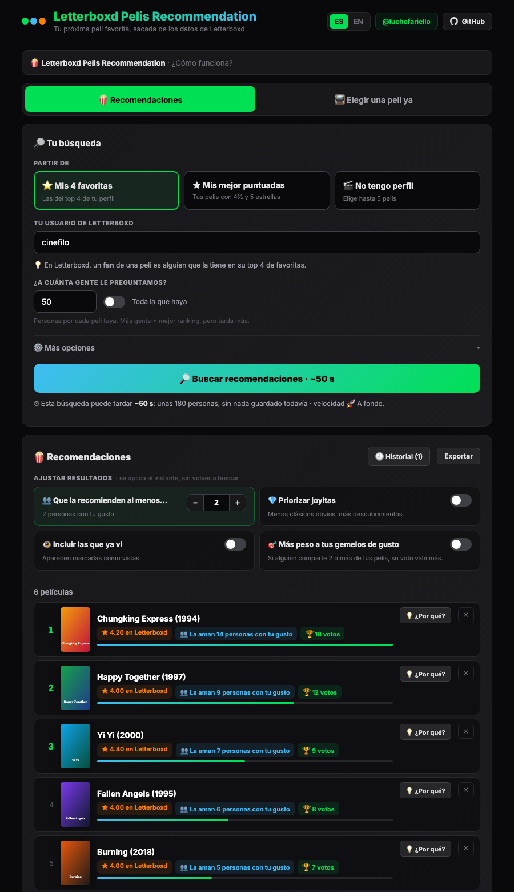
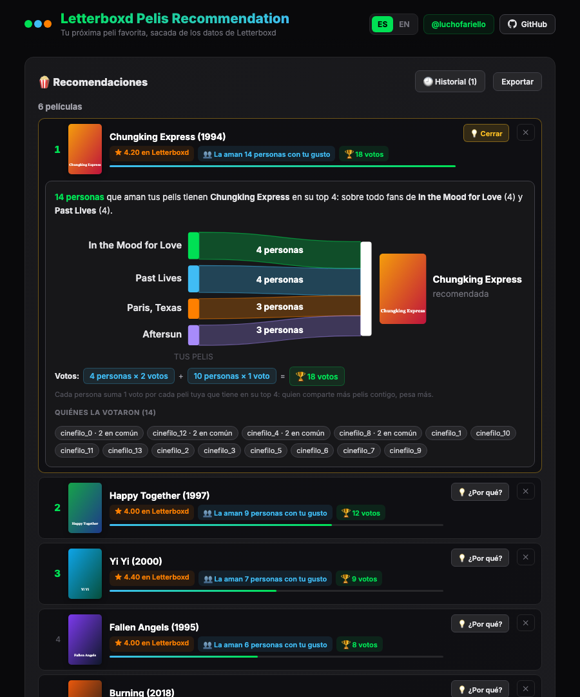
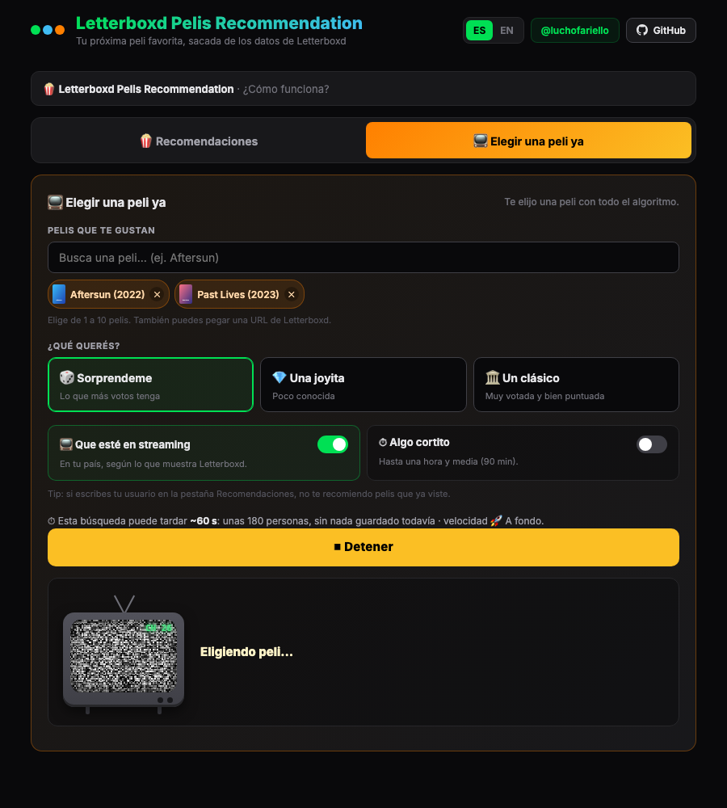
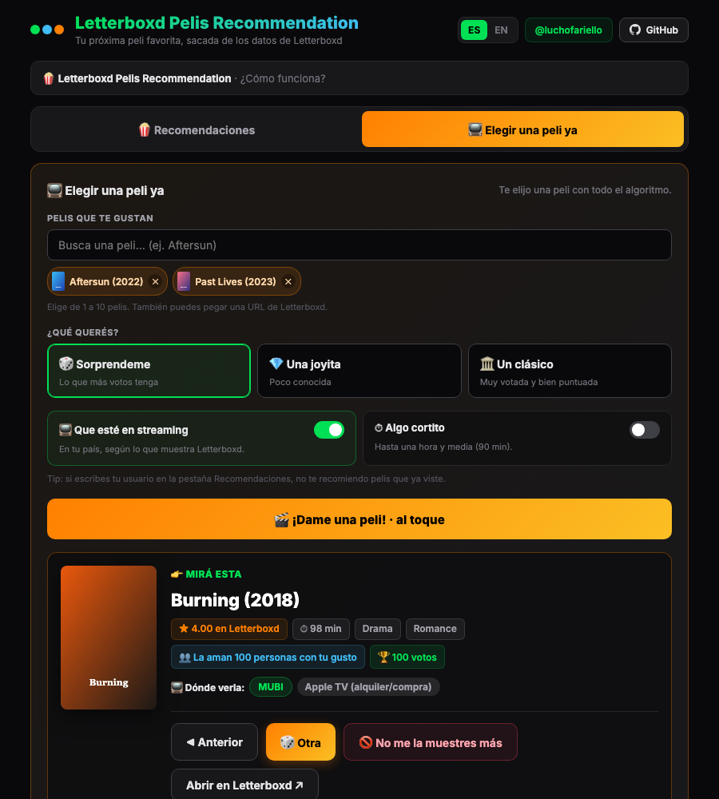
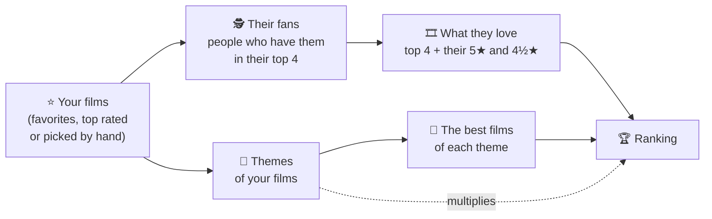

# 🍿 Letterboxd Pelis Recommendation

**Your next favorite film, squeezed out of Letterboxd data.**

A Chrome extension that recommends films based on what you already love: it finds the people who have your favorite films in their Letterboxd top 4, looks at what else they love, and ranks the films that repeat the most among them — skipping the ones you've already seen.

> The idea is simple: **if someone loves the same films you do, whatever else they love will probably click with you too.**



🇪🇸 *[Leer en español](README.md)*

---

## ✨ Features

### 🍿 Recommendations
Builds a ranking of films you might like. You can start from:

- **⭐ Your 4 favorites** on your Letterboxd profile.
- **★ Your top rated** films (rated 4½ and 5 stars).
- **🎬 I don't have a profile**: search and pick up to 5 films you love.

Once the search is done, you can **tune the results instantly**, with no new requests:

| Setting | What it does |
|---|---|
| 👥 Recommended by at least… | Only shows films shared by at least N people with your taste. Starts with a **suggested value** (1.5% of the people checked) shown when the results load; you can change it by hand. |
| 🧩 Boost similar themes | Multiplies the score of films that share **themes** (Letterboxd's *Genres* section) with yours, and adds films reached only by theme (see below). |
| 💎 Prioritize hidden gems | *Fewer obvious classics, more discoveries*: downweights films everyone loves and boosts the ones your "taste twins" love but almost nobody else does. |
| 👁 Include films I've seen | Also shows films you've already logged on Letterboxd. |
| 🎯 More weight to your taste twins | If someone shares 2 or more of your films, their vote counts more (x5), or only they are counted. |

Results are split into two tabs: **👥 By fans** and **🧩 Theme only** (films no fan has among their favorites, but that share themes with yours).

Every film has a **💡 Why?** button that opens a diagram showing where the recommendation comes from: which of your films connect to it, how many people voted for it, **which themes and subthemes it shares with your films** (by name, and which of your films they come from) and the full score calculation, row by row.



Also:
- **🕘 History** of your last 10 searches, to reopen them instantly.
- **⏱ Time estimate** before searching (it learns from the real speed of your searches).
- **Export** the ranking to a text file.
- The UI is available in **Spanish and English**.

### 📺 Pick a film now
For when you don't want to think: pick a few films you love with the search box, choose **what you want** (🎲 Surprise me · 💎 A hidden gem · 🏛 A classic) and get **a single film**, with where to watch it. It uses the same algorithm (fans + theme multiplier).

- **📺 Available to stream**: only films available in **Argentina**, based on Letterboxd's "Where to watch" (services from other countries are ignored). Change the country with `AVAIL_COUNTRY` in `app.js`.
- **⏱ Something short**: up to an hour and a half.
- Shows the first recommendation **within 40 seconds** and keeps processing in the background so **🎲 Another** gets even better.
- **◀ Previous** to go back to one you skipped and **🚫 Don't show it again** to discard it forever.

| Picking… | Watch this one! |
|---|---|
|  |  |

---

## 🧠 How it works



1. **Your starting films**: read from your Letterboxd profile (or picked with the search box).
2. **Their fans**: on Letterboxd, a *fan* of a film is someone who has it in their top 4 favorites. For each of your films, a number of fans is taken (50 by default). Letterboxd only lets you see the first 256 pages of fans of each film (about 6,400 people), even if it has more.
3. **What each fan loves**, with different weights:
   - their **top 4** is worth **1 vote** per film;
   - up to 15 of their **5★** films are worth **0.5** and up to 15 of their **4½★** films are worth **0.25** (optional, ⭐ in *More options*; slower: two extra requests per person).
4. **Each person's weight**: multiplied by **how many of your films they share**. With 🎯 *taste twins*, someone sharing 2 or more counts more (x5), or only they are counted.
5. **Themes** (each film's *Genres* section on Letterboxd): the themes of your starting films are collected and each candidate's score is **multiplied** by how many it shares with yours.

   | Shared themes | Multiplier |
   |---|---|
   | 1 · 2 · 3 · 4 | ×1.2 · ×1.4 · ×1.6 · ×1.8 |
   | 5 · 6 · 7… | ×2.2 · ×2.6 · ×3.0… (+0.4 per theme) |

   **Subthemes** (words shared between *mini-themes*, like `heist` or `cops`) add **+0.05** each to the multiplier (up to 8). Example: 2 themes (×1.4) + 4 subthemes = **×1.6**.
6. **Theme-only films**: the 15 most repeated themes among your films are taken, and the **50 top rated films of each**. Each list is weighted by how repeated its theme is, and only films appearing in **2 or more lists** get in. They're worth little (0.5 × list weight), so they're shown separately in the **🧩 Theme only** tab.
7. **The ranking**: the votes of all people are added up, the multipliers are applied, and your starting films and the ones you've seen are excluded.

**💎 Hidden gems**: the score is divided by the square root of the film's popularity (number of ratings on Letterboxd, plus a 5,000 cushion so a film with very few ratings doesn't win by chance).

---

## 📥 Installation

The extension isn't on the Chrome Web Store yet, so it's installed "unpacked" (takes a minute):

1. **Download the code**
   - With git: `git clone https://github.com/luchofariello/letterbox-pelis-recomendation.git`
   - Without git: green **Code → Download ZIP** button on GitHub, then unzip it.
2. Open Chrome and go to **`chrome://extensions`**.
3. Turn on **Developer mode** (top right).
4. Click **"Load unpacked"** and select the project folder (the one containing `manifest.json`).
5. Chrome will ask for permission to **read data on letterboxd.com**: that's what it needs to query Letterboxd.
6. Pin the extension with the puzzle icon 🧩 and click its icon (the three colored dots) to open it.

**Requirements:** Chrome 116 or newer. It should also work on other Chromium-based browsers (Edge, Brave, Arc) the same way, although it hasn't been tested on all of them. It doesn't work on Firefox or Safari.

### Updating
Get the new version (`git pull` or a new ZIP in the same folder), go to `chrome://extensions`, click **↻** on the extension and reopen its tab.

---

## 🚀 Quick start

1. Click the extension icon: it opens in its own tab (so you can keep browsing Letterboxd without interrupting the search).
2. In **🍿 Recommendations**, type your Letterboxd username (or choose *I don't have a profile*) and click **Find recommendations**.
3. While the popcorn bucket fills up 🍿, the ranking builds itself.
4. Play with the settings, open the **💡 Why?** panels and add the ones you like to your Letterboxd watchlist.
5. Don't want to choose? Go to **📺 Pick a film now**.

**Approximate times:** the first search with 4 films and 50 people per film takes a few minutes. The next ones are much faster because everything is cached (each person's top 4 is remembered for 30 days). In **⚙️ More options** you can change the **speed** (🐢 Chill · 🚶 Normal · 🏃 Fast · 🚀 Full throttle) and force a search without cache.

---

## 🔒 Privacy and permissions

Everything runs **in your browser**. The extension has no server, no accounts and doesn't send your data anywhere: it only reads **public Letterboxd pages** and stores the results on your computer.

| Permission | Why |
|---|---|
| `https://letterboxd.com/*` | Read public Letterboxd pages (profiles, each film's fans, film data and themes, where to watch). |
| `storage`, `unlimitedStorage` | Store the cache and history in your browser (with thousands of people the regular limit isn't enough). |

What's stored in your browser (and for how long):

| Data | Duration |
|---|---|
| Top 4 of each person checked (and their 5★ / 4½★, if enabled) | 30 days |
| Each film's data (poster, average, ratings, runtime, themes) | 14 days |
| Each film's fan lists and top-rated-by-theme lists | 7 days |
| Where each film can be watched | 3 days |
| Your watched films | 12 hours |
| Search history | last 10 |

To delete everything: `chrome://extensions` → remove the extension.

---

## ⚠️ Notes

- This is **not an official extension** and it isn't affiliated with Letterboxd. Letterboxd has no public API, so the extension reads the HTML of its public pages: **if Letterboxd changes its site, something may stop working** until the extension is updated.
- To avoid overloading Letterboxd, requests are spaced out. If Letterboxd asks to slow down (error 429), the extension pauses everything for 60 seconds and retries. Please use it moderately and respect Letterboxd's terms of use.
- **Streaming** data is what Letterboxd shows for **Argentina** (it comes from JustWatch). If it can't be read, the film is still shown with a link to check it on Letterboxd.
- **Theme-only** films come from lists that Letterboxd loads separately (`/csi/…`). If it blocks them, the Log shows an HTTP error and the search continues without those films.
- The **Log** (at the bottom of the Recommendations tab) shows everything it's doing, useful if something fails.

---

## 🗂 Project structure

```
├── manifest.json     # extension config (Manifest V3)
├── background.js     # opens the extension tab when the icon is clicked
├── app.html          # the extension page
├── app.js            # all the logic: Letterboxd requests, algorithm, cache and UI
├── app.css           # styles
├── icons/            # extension icons
└── docs/screenshots/ # README screenshots
```

No dependencies and no build step: it's plain JavaScript.

### Development
1. Edit `app.js` / `app.css`.
2. In `chrome://extensions`, click **↻** on the extension and reopen its tab.
3. To debug: right-click the extension page → **Inspect** (console), and the **Log** in the Recommendations tab.

UI texts live in the `I18N` object at the top of `app.js` (Spanish and English).

---

## 🙌 Credits

- Created by [**@luchofariello**](https://github.com/luchofariello).
- The Letterboxd reading functions are originally based on the *Letterboxd MassFollow* script by [@Miabeyefendi](https://letterboxd.com/miabeyefendi/).
