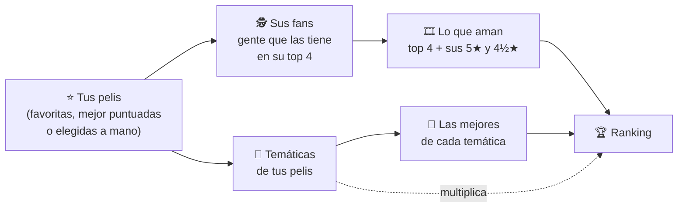

# 🍿 Letterboxd Pelis Recommendation

**Tu próxima peli favorita, sacada de los datos de Letterboxd.**

Extensión de Chrome que te recomienda películas a partir de lo que ya amás: busca a la gente que tiene tus pelis favoritas en su top 4 de Letterboxd, mira qué otras pelis aman ellos y te arma un ranking con las que más se repiten y todavía no viste.

> La idea es simple: **si alguien ama las mismas pelis que vos, lo demás que ama probablemente también te va a gustar.**


🇬🇧 *[Read this in English](README.en.md)*

---

## ✨ Qué hace

### 🍿 Recomendaciones
Arma un ranking de pelis que te pueden gustar. Podés partir de:

- **⭐ Tus 4 favoritas** de tu perfil de Letterboxd.
- **★ Tus mejor puntuadas** (las que calificaste con 4½ y 5 estrellas).
- **🎬 No tengo perfil**: buscás y elegís hasta 5 pelis que te gusten.

Una vez que termina la búsqueda, podés **ajustar los resultados al instante**, sin volver a consultar nada:

| Ajuste | Qué hace |
|---|---|
| 👥 Que la recomienden al menos… | Solo muestra pelis que repiten al menos N personas con tu gusto. Arranca con un **valor sugerido** (1,5% de las personas revisadas) que ves al cargar los resultados, y lo podés cambiar a mano. |
| 🧩 Sumar por temáticas parecidas | Multiplica el puntaje de las pelis que comparten **temáticas** (la sección *Genres* de Letterboxd) con las tuyas, y agrega pelis que llegan solo por temática (ver más abajo). |
| 💎 Priorizar joyitas | *Menos clásicos obvios, más descubrimientos*: baja las pelis que le gustan a todo el mundo y sube las que aman tus "gemelos de gusto" pero casi nadie más. |
| 👁 Incluir las que ya vi | Muestra también las que ya marcaste como vistas en Letterboxd. |
| 🎯 Más peso a tus gemelos de gusto | Si alguien comparte 2 o más de tus pelis, su voto vale más (x5), o directamente se escucha solo a ellos. |

Los resultados se dividen en dos pestañas: **👥 Por fans** y **🧩 Solo por temática** (pelis que ningún fan tiene entre sus favoritas, pero que comparten temáticas con las tuyas).

Cada peli tiene un botón **💡 ¿Por qué?** que despliega un diagrama con de dónde sale la recomendación: qué pelis tuyas la conectan, cuántas personas la votaron, **qué temáticas y subtemáticas comparte con tus pelis** (con el nombre y de cuál de tus pelis vienen) y la cuenta completa del puntaje, fila por fila.


Además:
- **🕘 Historial** de las últimas 10 búsquedas, para volver a verlas al instante.
- **⏱ Estimación de tiempo** antes de buscar (se ajusta con la velocidad real de tus búsquedas).
- **Exportar** el ranking a un archivo de texto.
- La interfaz está en **español e inglés**.

### 📺 Elegir una peli ya
Para cuando no querés pensar: elegís unas pelis que te gustan con el buscador, decís **¿qué querés?** (🎲 Sorprendeme · 💎 Una joyita · 🏛 Un clásico) y te tira **una sola peli**, con dónde verla. Usa el mismo algoritmo (fans + multiplicador por temáticas).

- **📺 Que esté en streaming**: solo pelis disponibles en **Argentina**, según el "Where to watch" de Letterboxd (se ignoran los servicios de otros países). El país se cambia en `AVAIL_COUNTRY` de `app.js`.
- **⏱ Algo cortito**: hasta una hora y media.
- Te muestra la primera recomendación **a los 40 segundos como máximo** y sigue procesando atrás para que **🎲 Otra** sea todavía mejor.
- **◀ Anterior** para volver a una que pasaste y **🚫 No me la muestres más** para descartarla para siempre.

| Eligiendo… | ¡Mirá esta! |
|---|---|
|  |  |

---

## 🧠 Cómo funciona



1. **Tus pelis de partida**: se leen de tu perfil de Letterboxd (o las elegís con el buscador).
2. **Sus fans**: en Letterboxd, un *fan* de una peli es alguien que la tiene en su top 4 de favoritas. Por cada peli tuya se toma una cantidad de fans (50 por defecto). Letterboxd solo deja ver las primeras 256 páginas de fans de cada peli (unas 6.400 personas), aunque tenga más.
3. **Lo que ama cada fan**, con distinto peso:
   - su **top 4** vale **1 voto** por peli;
   - hasta 15 de sus **5★** valen **0,5** y hasta 15 de sus **4½★** valen **0,25** (opcional, ⭐ en *Más opciones*; tarda más: dos consultas extra por persona).
4. **Peso de cada persona**: multiplica según **cuántas de tus pelis comparte**. Con 🎯 *gemelos de gusto*, quien comparte 2 o más vale más (x5), o se escucha solo a ellos.
5. **Temáticas** (la sección *Genres* de cada peli en Letterboxd): se juntan las de tus pelis de partida y el puntaje de cada candidata se **multiplica** según cuántas comparte con las tuyas.

   | Temáticas en común | Multiplicador |
   |---|---|
   | 1 · 2 · 3 · 4 | ×1,2 · ×1,4 · ×1,6 · ×1,8 |
   | 5 · 6 · 7… | ×2,2 · ×2,6 · ×3,0… (+0,4 por temática) |

   Las **subtemáticas** (palabras que comparten los *mini-themes*, por ejemplo `heist` o `cops`) suman **+0,05** cada una al multiplicador (hasta 8). Ejemplo: 2 temáticas (×1,4) + 4 subtemáticas = **×1,6**.
6. **Pelis solo por temática**: se toman las 15 temáticas más repetidas en tus pelis y las **50 mejor puntuadas de cada una**. Cada lista pesa según qué tan repetida es su temática, y solo entran las que salen en **2 o más listas**. Valen poco (0,5 por peso de lista), así que se muestran aparte, en la pestaña **🧩 Solo por temática**.
7. **El ranking**: se suman los votos de todas las personas, se aplican los multiplicadores y se excluyen tus pelis de partida y las que ya viste.

**💎 Joyitas**: el puntaje se divide por la raíz cuadrada de la popularidad de la peli (cantidad de calificaciones en Letterboxd, con un colchón de 5.000 para que una peli con poquísimos votos no gane de casualidad).

---

## 📥 Instalación

La extensión todavía no está en la Chrome Web Store, así que se instala "descomprimida" (tarda 1 minuto):

1. **Descargá el código**
   - Con git: `git clone https://github.com/luchofariello/letterbox-pelis-recomendation.git`
   - O sin git: botón verde **Code → Download ZIP** en GitHub, y descomprimilo.
2. Abrí Chrome y andá a **`chrome://extensions`**.
3. Activá el **Modo de desarrollador** (arriba a la derecha).
4. Tocá **"Cargar descomprimida"** y elegí la carpeta del proyecto (la que tiene el `manifest.json`).
5. Chrome te va a pedir permiso para **leer datos en letterboxd.com**: es lo que necesita para consultar Letterboxd.
6. Fijá la extensión con el ícono del rompecabezas 🧩 y tocá su ícono (los tres puntitos de colores) para abrirla.

**Requisitos:** Chrome 116 o más nuevo. También debería funcionar en otros navegadores basados en Chromium (Edge, Brave, Arc) con el mismo procedimiento, aunque no está probado en todos. No funciona en Firefox ni en Safari.

### Actualizar
Bajá la versión nueva (`git pull` o un ZIP nuevo en la misma carpeta), andá a `chrome://extensions`, tocá **↻** en la extensión y volvé a abrir su pestaña.

---

## 🚀 Uso rápido

1. Tocá el ícono de la extensión: se abre en su propia pestaña (así podés seguir navegando Letterboxd sin cortar la búsqueda).
2. En **🍿 Recomendaciones**, escribí tu usuario de Letterboxd (o elegí *No tengo perfil*) y tocá **Buscar recomendaciones**.
3. Mientras se llena el balde de pochoclos 🍿, el ranking se va armando solo.
4. Jugá con los ajustes, abrí los **💡 ¿Por qué?** y guardá las que te gusten en tu watchlist de Letterboxd.
5. ¿No querés elegir? Andá a **📺 Elegir una peli ya**.

**Tiempos aproximados:** la primera búsqueda con 4 pelis y 50 personas por peli tarda unos minutos. Las siguientes son mucho más rápidas porque todo queda guardado (el top 4 de cada persona se recuerda 30 días). En **⚙️ Más opciones** podés cambiar la **velocidad** (🐢 Tranqui · 🚶 Normal · 🏃 Rápido · 🚀 A fondo) y forzar una búsqueda sin caché.

---

## 🔒 Privacidad y permisos

Todo corre **en tu navegador**. La extensión no tiene servidor propio, no usa cuentas ni manda tus datos a ningún lado: solo lee **páginas públicas de Letterboxd** y guarda los resultados en tu computadora.

| Permiso | Para qué |
|---|---|
| `https://letterboxd.com/*` | Leer páginas públicas de Letterboxd (perfiles, fans de cada peli, datos y temáticas de las pelis, dónde verlas). |
| `storage`, `unlimitedStorage` | Guardar la caché y el historial en tu navegador (con miles de personas no alcanza el límite normal). |

Lo que queda guardado en tu navegador (y cuánto dura):

| Dato | Duración |
|---|---|
| Top 4 de cada persona consultada (y sus 5★ / 4½★, si está activado) | 30 días |
| Datos de cada peli (portada, promedio, calificaciones, duración, temáticas) | 14 días |
| Listas de fans de cada peli y listas de mejores por temática | 7 días |
| Dónde se puede ver cada peli | 3 días |
| Tus pelis vistas | 12 horas |
| Historial de búsquedas | las últimas 10 |

Para borrar todo: `chrome://extensions` → quitar la extensión.

---

## ⚠️ Avisos

- **No es una extensión oficial** ni está afiliada a Letterboxd. Letterboxd no tiene una API pública, así que la extensión lee el HTML de sus páginas públicas: **si Letterboxd cambia su sitio, algo puede dejar de funcionar** hasta que se actualice.
- Para no saturar Letterboxd, las consultas tienen pausas entre sí. Si Letterboxd pide ir más despacio (error 429), la extensión frena todo 60 segundos y reintenta. Usala con moderación y respetando los términos de uso de Letterboxd.
- Los datos de **streaming** son los que Letterboxd muestra para **Argentina** (vienen de JustWatch). Si no se pueden leer, la peli se muestra igual con un link para verlo en Letterboxd.
- Las pelis **por temática** salen de listas que Letterboxd carga aparte (`/csi/…`). Si las bloquea, en el Log aparece un error HTTP y la búsqueda sigue sin esas pelis.
- El **Log** (al final de la pestaña Recomendaciones) muestra todo lo que va haciendo, útil si algo falla.

---

## 🗂 Estructura del proyecto

```
├── manifest.json     # configuración de la extensión (Manifest V3)
├── background.js     # abre la pestaña de la extensión al tocar el ícono
├── app.html          # la página de la extensión
├── app.js            # toda la lógica: consultas a Letterboxd, algoritmo, caché e interfaz
├── app.css           # estilos
├── icons/            # íconos de la extensión
└── docs/screenshots/ # capturas del README
```

No hay dependencias ni paso de compilación: es JavaScript plano.

### Desarrollo
1. Editá `app.js` / `app.css`.
2. En `chrome://extensions`, tocá **↻** en la extensión y volvé a abrir su pestaña.
3. Para depurar: clic derecho en la página de la extensión → **Inspeccionar** (consola), y el **Log** de la pestaña Recomendaciones.

Los textos de la interfaz están en el objeto `I18N` al principio de `app.js` (español e inglés).

---

## 🙌 Créditos

- Creado por [**@luchofariello**](https://github.com/luchofariello).
- Las funciones de lectura de Letterboxd se basan originalmente en el script *Letterboxd MassFollow* de [@Miabeyefendi](https://letterboxd.com/miabeyefendi/).
